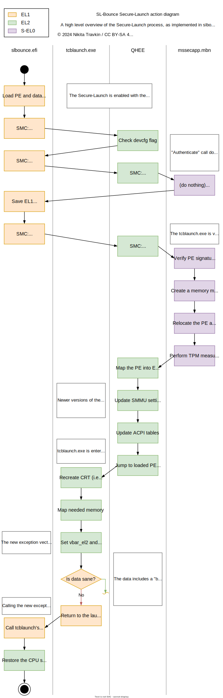

SLBounce theory of operation
============================

slbounce.efi implements [Qualcomm's implementation of Secure-Launch](https://github.com/TravMurav/Qcom-Secure-Launch)
which is designed to allow Microsoft Windows to boot Hyper-V in EL2 and perform DRTM as part of this.

Since the Secure-Launch code checks signatures of the boot payload, slbounce only allows booting `tcblaunch.exe` in
a way, similar to what `winload.efi` does when normally booting Windows. SLBounce creates all the necessary data to
go through the signature checks, TPM measurements and EL2 transition, ensuring Qualcomm's QHEE allows `tcblaunch.exe`
to take over EL2.

An interesting feature in `tcblaunch.exe` allows it to return the execution back to `winload.efi` in case of an early
critical failure. SLBounce makes use of that feature to regain control of the system after tcblaunch has been loaded
and suffers such (intentionally inflicted) failure. After that, the side effects of `tcblaunch.exe` gaining control
of EL2 (such as teardown of QHEE and the new EL2 exception vector) allow SLBounce to elevate into now-vacant EL2 state.

This allows SLBounce to restore the CPU state in EL2 and effectively perform a EL1 to EL2 transition.

A simplified action diagram for Secure-Launch follows.

